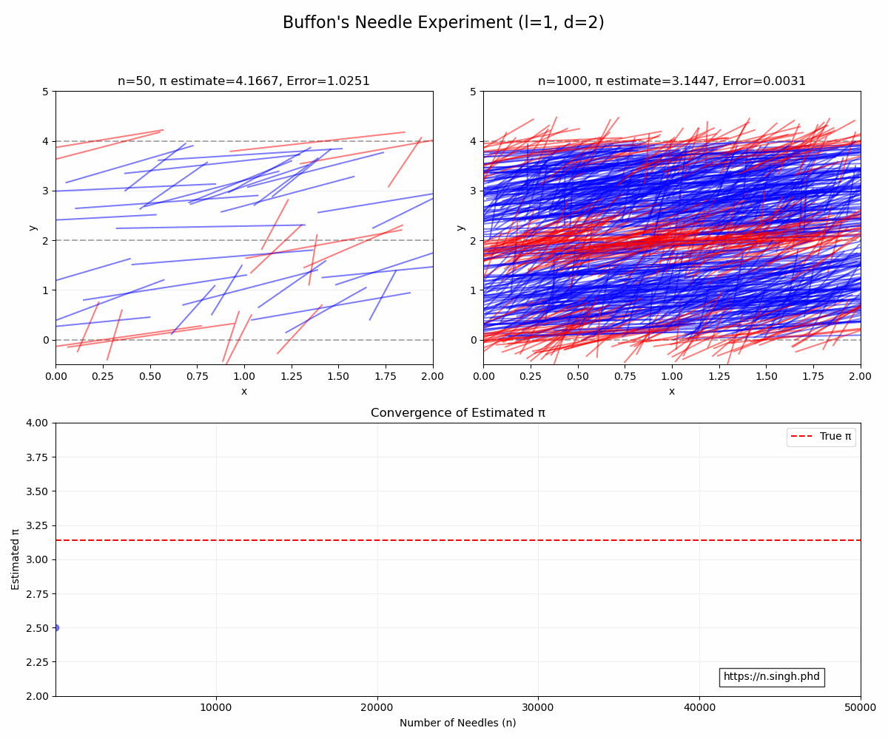
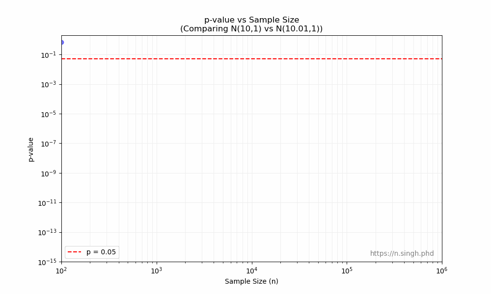
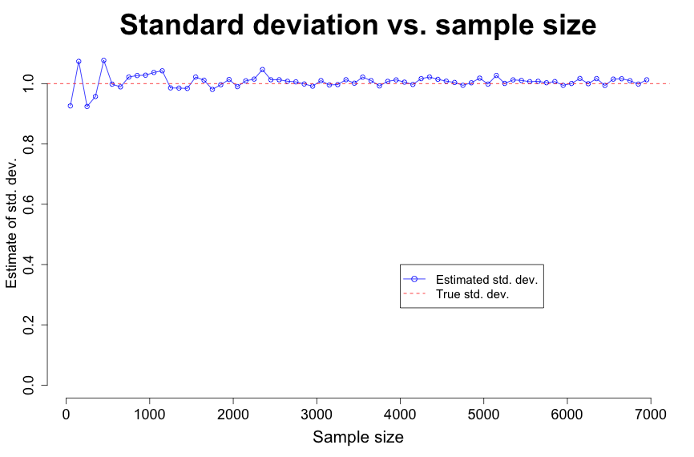
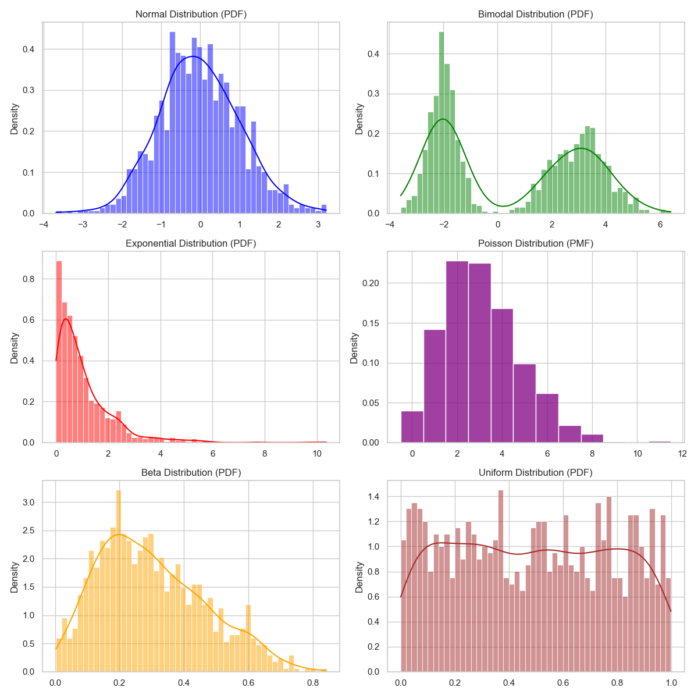
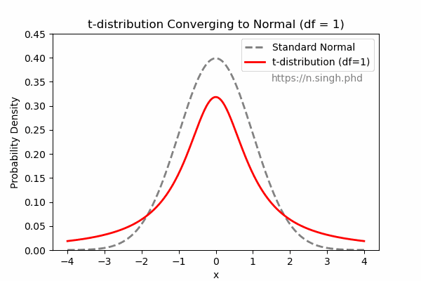
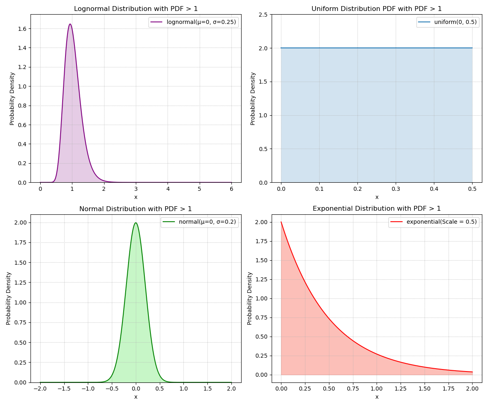
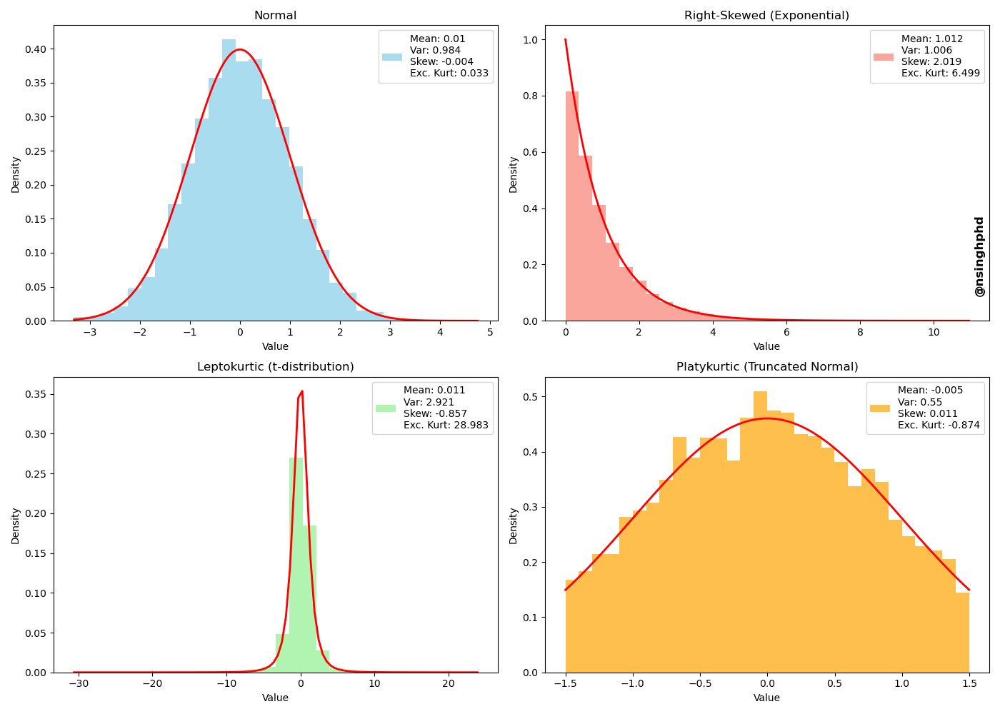
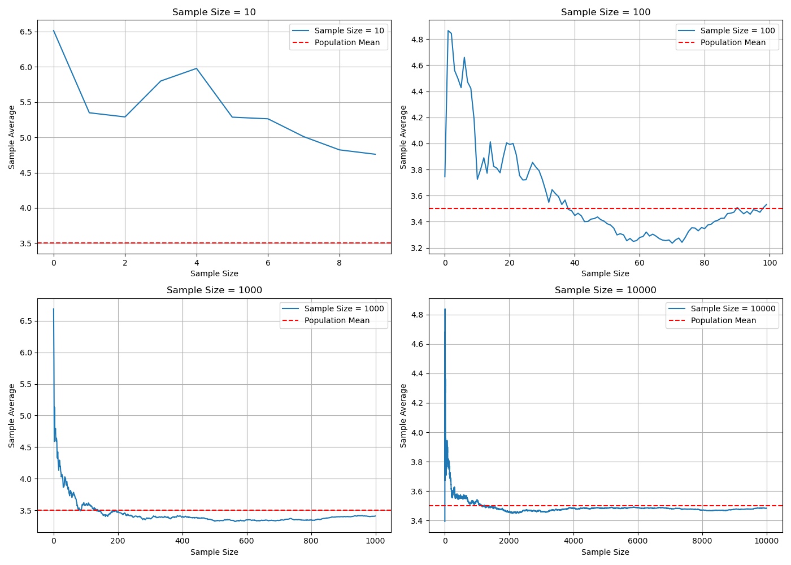

# Scripts and plots gallery

This table shows the scripts (sorted by date) and their corresponding plots:

| Script | Plot |
|--------|------|
| [250314_Buffon-needle-pi.py](250314_Buffon-needle-pi.py) |  |
| [250221_sampleSize_pvalue.py](250221_sampleSize_pvalue.py) |  |
| [250206_sampleSize_SD.R](250206_sampleSize_SD.R) |  |
| [241018_CLT-pop-dists.py](241018_CLT-pop-dists.py) |  |
| [240923_t-dist_to_std_normal.py](240923_t-dist_to_std_normal.py) |  |
| [240814_PDFs_>_1.py](240814_PDFs_>_1.py) |  |
| [240614_moments_plots.py](240614_moments_plots.py) |  |
| [240522_LLN_plots_2x2.py](240522_LLN_plots_2x2.py) |  |
